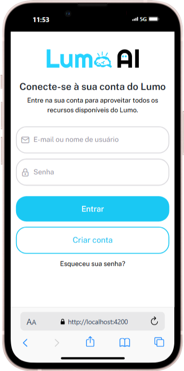
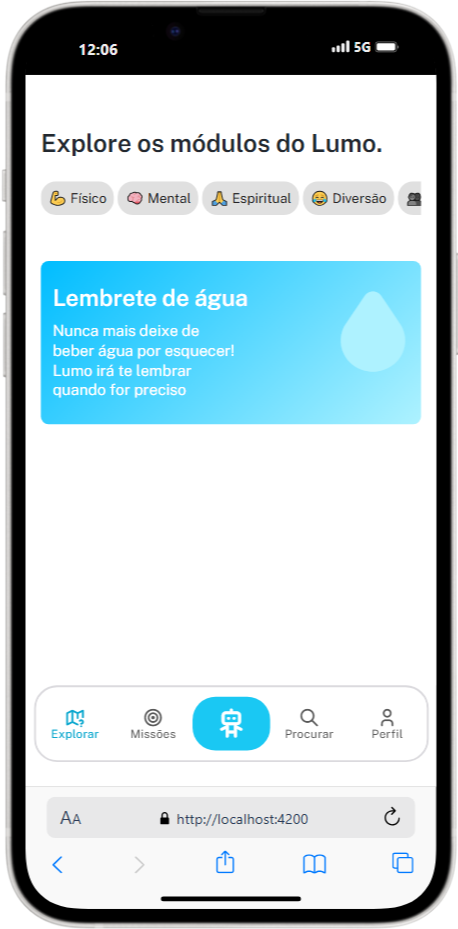
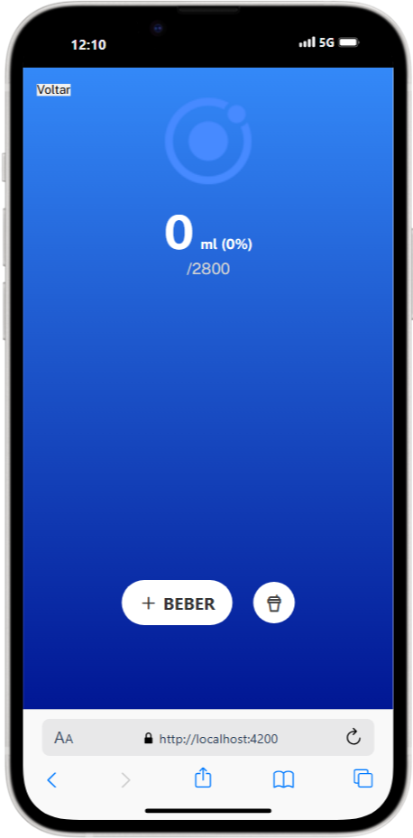

# Aplicativo mobile - Lumo 🤖
 

O assistente pessoal Lumo é um companheiro para suas tarefas diárias e um auxiliador para a manutenção de bons hábitos de saúde física, mental, espiritual e social.

Esse repositório diz respeito a uma das camadas do projeto, que é o *Aplicativo mobile*. Pelo app, é possível habilitar e desabilitar módulos do robô físico, interagir com amigos e acompanhar as métricas da IA.

## Explorar módulos 

Ao entrar no app, é possível visualizar todos os módulos do robô, em categorias. No momento, só é possível acessar o módulo de lembrete de água, que posteriormente será vinculado com o Lumo.

> [!IMPORTANT]  
> A interface está em constante manutenção, e, em breve, novas funcionalidades serão adicionadas!
